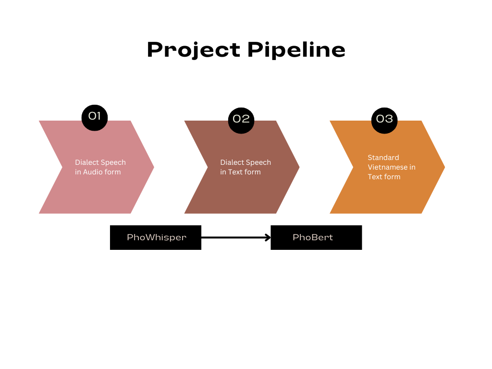
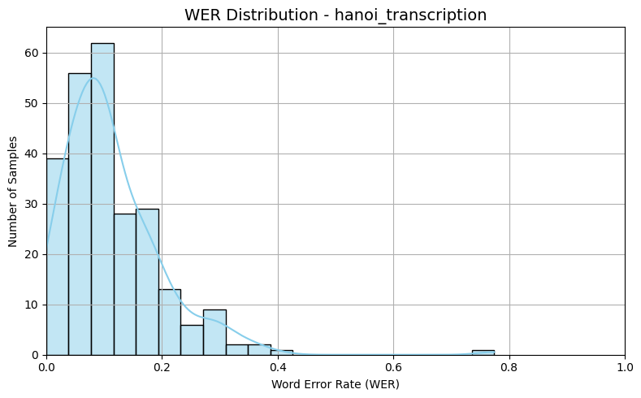
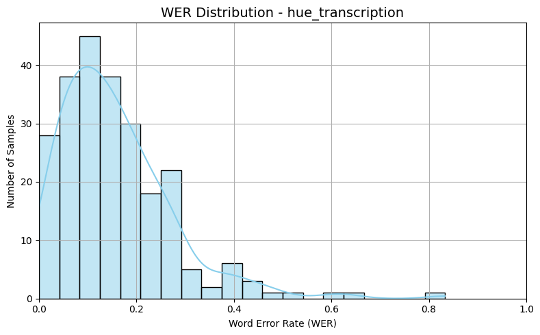
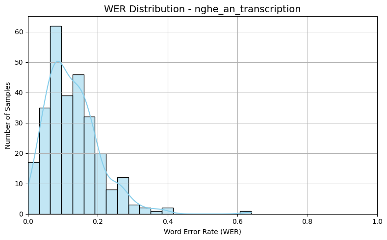
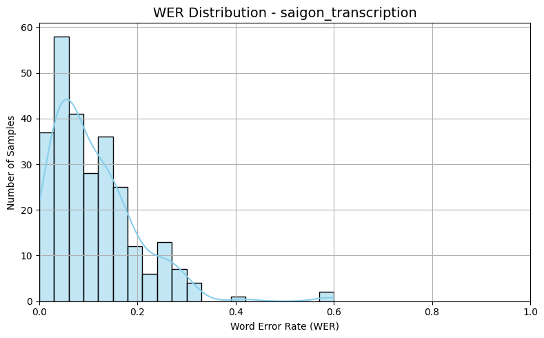

<!--<!DOCTYPE html>-->
<!-- saved from url=(0014)about:internet -->
<html lang=" en-US"><head><meta http-equiv="Content-Type" content="text/html; charset=UTF-8">
  
  <meta http-equiv="X-UA-Compatible" content="IE=edge">
  <meta name="viewport" content="width=device-width, initial-scale=1">
  <title>NLP Class Project | Spring 2025 CSCI 5541 | University of Minnesota</title>

  <link rel="stylesheet" href="./csci5541_webtemplate/files/bulma.min.css" />

  <link rel="stylesheet" href="./csci5541_webtemplate/files/styles.css">
  <link rel="preconnect" href="https://fonts.gstatic.com/">
  <link href="./files/css2" rel="stylesheet">
  <link href="./files/css" rel="stylesheet">

  <base href="." target="_blank"></head>

<body>
  

    

      <h1 style="font-family: &#39;Lato&#39;, sans-serif;">Speech-to-Text: Translate Dialects to Official Vietnamese Language</h1>
      <h4 style="font-family: &#39;Lato&#39;, sans-serif; ">Spring 2025 CSCI 5541 NLP: Class Project - University of Minnesota</h4>
      <h4 style="font-family: &#39;Lato&#39;, sans-serif; ">The Parsing Pals</h4>

      

        
        

          

                        
              
            
            
          

          

                        
              Member 1: Bang Ly
            
          

        

        
        

          

            
            
            
          

          

            
            Member 2: Khanh Chi Le
            
          

        

        
        

          

            
                          
            
          

          

              Member 3: Huong Giang To
          

        

        
<!--         

          

                        
              
            
          

          

            Member 4
          

        
 -->
        
      

       

      

        

          <!-- Github link -->
          
            <a
              href=""
              target="_blank"
              class="external-link button is-normal is-rounded is-dark is-outlined"
            >
            Final Report
            </a>
          
          
            <a
              href=""
              target="_blank"
              class="external-link button is-normal is-rounded is-dark is-outlined"
            >
            Code
            </a>
                
          
            <a
              href=""
              target="_blank"
              class="external-link button is-normal is-rounded is-dark is-outlined"
            >
            Model Weights
            </a>
                        
        

      

    

  

  
  

  

    

    
    <h2 id="abstract">Abstract</h2>

  Vietnamese exhibits diverse phonetic variations, which pose significant challenges for state-of-the-art speech-to-text systems. 
  While progress in Vietnamese speech-to-text technology has been substantial, with advancements in pre-trained models and speech recognition systems, 
  their performance in handling multiple dialects remains poor. To address this, we aim to fine-tune existing models to improve their ability to translate various dialects more effectively. 
  Building on this, we hope to develop a system where the model processes dialectal speech and, instead of providing a direct word-for-word transcription, generates standard Vietnamese text 
  -  bridging communication gaps within the community.

<h2 id="teaser">Teaser Figure</h2>

A figure that conveys the main idea behind the project or the main application being addressed.

<!-- <h3 id="the-timeline-and-the-highlights">Any subsection</h3>

If you need to explain more about your figure
 -->

<h2 id="introduction">Introduction / Background / Motivation</h2>

 
Recently, the speech recognition community has made significant progress in building Deep Neural Networks (DNNs) for Speech-to-Text (STT) or
Speech-to-Text Recognition (STR) by utilizing vast amounts of training data and high-quality test sets.
Studies have shown that while current STT models perform well for high-resource languages
like French, English, and Mandarin, low-resource languages experience higher Word Error Rates
(WER) due to limited data. This challenge is even more pronounced in languages with diverse
phonetic variations and multiple dialects, such as Vietnamese (Ahlawat et al., 2025). 

Dialectal regions in Vietnam can have significantly different vocabularies, pronunciations, and tones, creating language
barriers even among Vietnamese speakers from different provinces. With recent advancements in Vietnamese NLP and Speech-to-Text systems, we aim to build
an STT pipeline that processes dialectal speech and, instead of providing a direct word-for-word transcription, generates standardized Vietnamese text.

<h2 id="approach">Approach</h2>

<b>What did you do exactly? How did you solve the problem? Why did you think it would be successful? Is anything new in your approach?</b>

Based on our pipeline, we take in input as audio files from the dataset: <a href="https://huggingface.co/datasets/nguyendv02/ViMD_Dataset">Multi-Dialect Vietnamese</a>, which is composed of 102.56 hours of data, representing 63 dialects in Vietnam. 
Due to the time limit in this course, we have chosen 4/5 dialects that has representative characterics for major dialects. The 4 dialects we chose are: 
<ul>
  <li>Hanoi (representative of Northern provinces)</li>
  <li>Saigon (representative of Southern provinces)</li>
  <li>Hue (representative of Central provinces)</li>
  <li>Nghe An (representative of dialects that contain heavy accents and unique local vocabulary) </li> 
</ul>

Using this audio input, we used PhoWhisper to generate the Vietnamese transcripts, and then we will fine tune PhoBERT to
generate the standardized translation to the dialectal transcripts.

We also collect audio data of dense dialectal voices from Youtube, Tiktok to add to our dataset. We will have to annotate these audio with standard language to get a reference text to compare with the PhoBert output. We expect to obtain 45 minutes - 1 hour worth of audio for each dialect.

We believe this is a reliable framework because of our strategy in choosing dialects, which is representative of all different common dialects in Vietnamese language.
Besides, the PhoWhisper and PhoBERT are model already fine tuned models in Vietnamese language. Our study will also include a comparative analysis on other LLMs such as 
GPT-3 and Qwen-3.

The novelty of our work lies in our in-depth investigation of how to leverage large language models (LLMs) to translate dialectal text into standardized language, rather than simply training LLMs on a mixture of dialectal and standardized text. This approach also advances Vietnamese speech-to-text systems by moving beyond transcription to include translation into standardized language. 

<b>What problems did you anticipate? What problems did you encounter? Did the very first thing you tried work?</b>

<ol>
  <li>We are not sure which dialect we should chose as the fifth one </li>
  <li>The audio in the datasets that we currently use don't include many local vocabulary, which is an essential part of a dialect. Because of this, the result of the PhoWhisper is very close to the text transcription already, making our work of translating dialect to standard language not obvious.</li>
</ol>

    
<h2 id="results">Results</h2>

<b>How did you measure success? What experiments were used? What were the results, both quantitative and qualitative? Did you succeed? Did you fail? Why?</b>

  Since we have only generated the transcripts of audio using PhoWhisper, we depend on the WER metric to measure how accurate the transcripts are compared to the text reference. 

<table>
  <thead>
    <tr>
      <th style="text-align: center"><strong>Dialect</strong></th>
      <th style="text-align: center">Nghe An</th>
      <th style="text-align: center">Hue</th>
      <th style="text-align: center">Ha Noi</th>
      <th style="text-align: center">Sai Gon</th>
    </tr>
  </thead>
  <tbody>
    <tr>
      <td style="text-align: center"><strong>WER</strong></td>
      <td style="text-align: center">0.1285</td>
      <td style="text-align: center">0.1567</td>
      <td style="text-align: center">0.1141</td>
      <td style="text-align: center">0.1105</td>
    </tr>
  </tbody>
  <caption>Table 1. WER for the PhoWhisper's transcription</caption>
</table>

Below are the WERs for each data point in each dialect
 

 
 

 
 

 
 

 

<!--  

   -->

<b>Error Analysis</b>

  
  Since Nghe An is the hardest dialects, we expect the WER to be highest among these samples. Here are TOP 5 samples that have the highest WER from the Nghe An audio samples:
   
  WER: 0.6000  
  REF: cảm thấy tự tin hơn  
  HYP: <b>ờ</b> cảm thấy <b>a</b> tự tin hơn <b>hơn</b>  
  <b>Error type: added random words</b>  
   
  WER: 0.5833 
  REF: thấy an tâm thôi cứ tốt sức khỏe cho cộng đồng thôi  
  HYP: thấy an tâm thôi <b>thôi</b> <b>tôi thắp</b> cho sức khoẻ <b>ổn đồng</b> thôi  
  <b>Error type: duplicate words, spelling, grammar, word order</b>  
   
  WER: 0.4167  
  REF: hôm nay tôi rất là vinh dự được khám của các ba bác sĩ chữa để mà tư vấn về sức khỏe nhất là xương khớp nghe tôi mừng quá chỉ dẫn rất là nhiệt tình  
  HYP: <b>sẽ ra bữa</b> hôm nay tôi rất vinh dự được ra khám của các bác sĩ chữa để mà tư vấn về sức khoẻ nhất nhất là cái là <b>sương</b> khớp nghe tôi mừng quá vì nó <b>chỉ</b> chỉ dẫn rất nhiệt tình  
  <b>Error type: spelling, added random words, duplicate words, missing words</b>  
   
  WER: 0.3111  
  REF: ủy ban nhân dân phường với coi như là đảng ủy phường kêu gọi thì tất cả những bác sĩ chúng tôi đều đăng ký hết tôi là người cao tuổi nhất coi như là cũng là người coi như là xung phong   tham gia  
  HYP: ủy ban nhân dân phường mới lại coi như đã đồng ý phường kêu gọi thì tất cả những bác sĩ là chúng tôi đều đăng ký hết tôi là <b>cái người</b> mà cao tuổi nhất là cũng là coi như là <b>cái người</b> mà coi như là xung phong tham gia  
  <b>Error type: duplicate words </b>  
   
  WER: 0.3103  
  REF: em cũng muốn là được sử dụng cái kỳ thi đánh giá năng lực này giống như là một cái con đường khác được xét tuyển vào đại học  
  HYP: em cũng muốn là được ờ sử dụng cái <b>kỳ thị giáng lực </b> này giống như một cái con đường khác ờ được <b>xét tiểu</b> đại học  
  <b>Error type: spelling, contain filler words</b>  

<h2 id="conclusion">Conclusion and Future Work</h2>

<b>Conclusion</b>

  From the above figures and table, our conclusion is that the WER for all data points are low, which means the PhoWhisper model is making accurate transcripts. However, this is not what we are expecting. We expect too see words that are written wrongly in tonal and words that are unique to a local dialect, not a perfect spelling and perfect standardized language in the transcripts, especially for hard dialects like Nghe An. This is due to our audio data containing only news anchor voices, and the news they are reading from contains only standardized scripts. Therefore, the audio are standardized language read in light tonal voices and meant to be easy to understand. For this reason, our next steps require us to find audios that are more heavy in dialect tones.

  <b>
  How easily are your results able to be reproduced by others?
  Did your dataset or annotation affect other people's choice of research or development projects to undertake?
  Does your work have potential harm or risk to our society? What kinds? If so, how can you address them?
  What limitations does your model have? How can you extend your work for future research?

  </b>

  - Our results might be easily reproduced by others since the pipeline is relatively simple. However, since there is not much data 
  on dialectal Vietnamese language systematically collected and annotated even though these dialects are still used prominently in each region, 
  combined with the fact that the PhoWhisper and PhoBERT model are new, no work has been done on this yet.

  - Some limitations our model might have is its runtime. It took us 50 mins to load the dataset, and 1.5 hours to run the PhoWhisper model on 
  4 different dialects. 

  

  

<!--</body></html>-->
