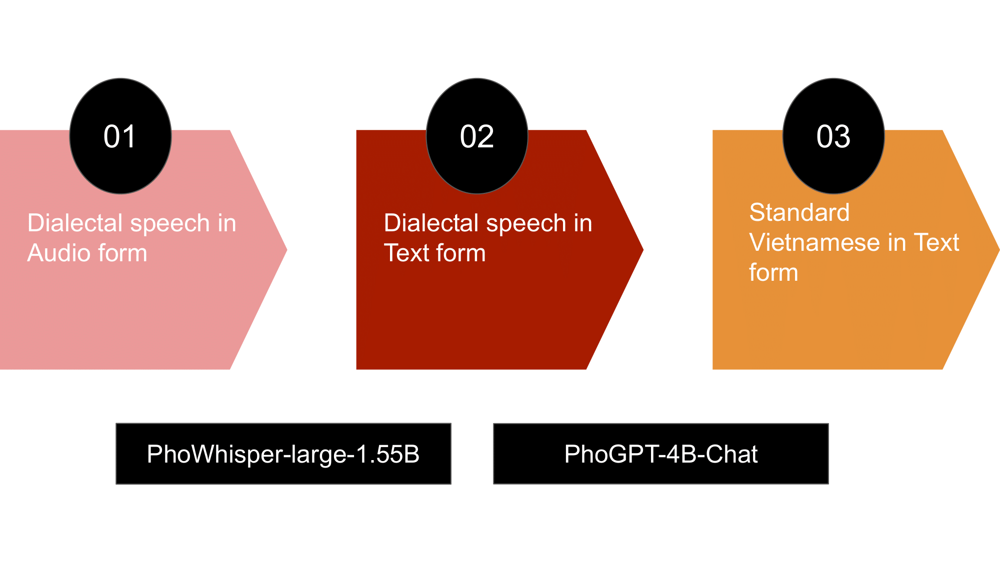
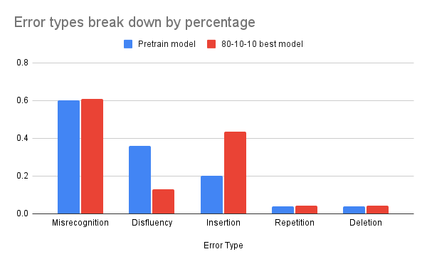
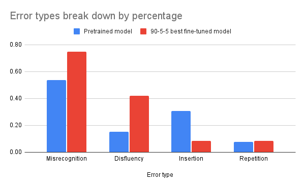

<!--<!DOCTYPE html>-->
<!-- saved from url=(0014)about:internet -->
<html lang=" en-US"><head><meta http-equiv="Content-Type" content="text/html; charset=UTF-8">
  
  <meta http-equiv="X-UA-Compatible" content="IE=edge">
  <meta name="viewport" content="width=device-width, initial-scale=1">
  <title>NLP Class Project | Spring 2025 CSCI 5541 | University of Minnesota</title>

  <link rel="stylesheet" href="./csci5541_webtemplate/files/bulma.min.css" />

  <link rel="stylesheet" href="./csci5541_webtemplate/files/styles.css">
  <link rel="preconnect" href="https://fonts.gstatic.com/">
  <link href="./files/css2" rel="stylesheet">
  <link href="./files/css" rel="stylesheet">

  <base href="." target="_blank"></head>

<body>
  

    

      <h1 style="font-family: &#39;Lato&#39;, sans-serif;">Speech-to-Text: Translate Dialects to Official Vietnamese Language</h1>
      <h4 style="font-family: &#39;Lato&#39;, sans-serif; ">Spring 2025 CSCI 5541 NLP: Class Project - University of Minnesota</h4>
      <h4 style="font-family: &#39;Lato&#39;, sans-serif; ">The Parsing Pals</h4>

      

        
        

          

                        
              
            
            
          

          

                        
              Member 1:   Bang Ly
            
          

        

        
        

          

            
            
            
          

          

            
            Member 2: Khanh Chi Le
            
          

        

        
        

          

            
                          
            
          

          

              Member 3: Huong Giang To
          

        

        
<!--         

          

                        
              
            
          

          

            Member 4
          

        
 -->
        
      

       

      

        

          <!-- Github link -->
          
            <a
              href="./csci5541_webtemplate/files/CSCI5541_The_Parsing_Pals_Final_Report.pdf"
              target="_blank"
              class="external-link button is-normal is-rounded is-dark is-outlined"
            >
            Final Report
            </a>
          
          
            <a
              href="https://github.com/chile2706/dialect-to-official-vietnamese?fbclid=IwY2xjawKKazVleHRuA2FlbQIxMABicmlkETFnUWpwYm1FaXhHT2x5UmJvAR5XvAyaIl7MBfO2-8Sr89WzIiY-zHrOs97t_XFl6wHEnBhTYE5w84pBn3TXjA_aem_ZlvNkTeGKanzueFs-xDwMA#"
              target="_blank"
              class="external-link button is-normal is-rounded is-dark is-outlined"
            >
            Code
            </a>
            
                        
        

      

    

  

  
  

  

    

    
<h2 id="abstract">Abstract</h2>

  Vietnamese exhibits diverse phonetic variations across regions, posing significant challenges for state-of-the-art speech-to-text (STT) systems. While recent advances in
pre-trained models have improved Vietnamese STT overall, their performance on dialectal speech remains limited. To address this issue, our project focuses on developing a pipeline that transcribes dialectal Vietnamese speech into standardized Vietnamese text – instead of providing a direct word-for-word transcription, the system generates standard Vietnamese to help bridge communication gaps within the community. Our work demonstrates the feasibility of this approach, showing that fine-tuning existing models on curated dialectal speech data can significantly improve performance in dialectal STT. In addition, we propose future directions for advancing Vietnamese STT, including more robust model adaptation and dialect-aware dataset development.

<!-- <h3 id="the-timeline-and-the-highlights">Any subsection</h3>

If you need to explain more about your figure
 -->

<h2 id="introduction">Introduction</h2>

Recently, the speech recognition community has made significant progress in building Deep Neural Networks (DNNs) for Speech-to-Text (STT) or Speech-to-Text Recognition (STR) by utilizing vast amounts of training data and high-quality test sets. Studies have shown that while current STT models perform well for high-resource languages like French, English, and Mandarin, low-resource languages experience higher Word Error Rates (WER) due to limited data. This challenge is even more pronounced in languages with diverse phonetic variations and multiple dialects, such as Vietnamese (Ahlawat et al., 2025).

Dialectal regions in Vietnam can have significantly different vocabularies, pronunciations, and tones, creating language barriers even among Vietnamese speakers from different provinces. With recent advancements in Vietnamese NLP and Speech-to-Text systems, we aim to build an STT pipeline that processes dialectal speech and, instead of providing a direct word-for-word transcription, generates standardized Vietnamese text.

<h2 id="approach">Approach</h2>

<b>Dataset</b>

Based on our pipeline, we take in input as audio files from the dataset: <a href="https://huggingface.co/datasets/nguyendv02/ViMD_Dataset">Multi-Dialect Vietnamese</a>, which is composed of 102.56 hours of data, representing 63 dialects in Vietnam. The dataset also contains reference text, which we will use as labels to compare with the LLMs' outputs.  Due to the time limit in this course, we have chosen 4 dialects that has representative characterics for major dialects. The 4 dialects we chose are: 
<ul>
  <li>Level 1 (Easy) Standard Vietnamese, to verify model performance in a non-dialectal setting. The specific dialect used for this Ha Noi dialect.</li>
  <li>Level 2 (Medium - Lexical) Huế dialect (Central Vietnam), selected for its distinct vocabulary.</li>
  <li>Level 3 (Medium - Tonal) Hồ Chí Minh City dialect (Southern Vietnam), chosen for its tonal shifts.</li>
  <li>Level 4 (Hard) Nghệ An/Hà Tĩnh dialect, widely regarded as the most difficult due to heavy tone merging and extensive vocabulary divergence from the standard. </li> 
</ul>

<b>Pipeline</b>

 Using audio inputs, we first generate Vietnamese transcripts with the pre-trained PhoWhisper model. Based on its initial performance in terms of Word Error Rate (WER) and BERTScore, we fine-tune PhoWhisper to improve upon these baseline results. We then use PhoGPT to convert the dialectal transcripts into standardized Vietnamese. For benchmarking purposes, we also evaluate a parallel pipeline using OpenAI’s Whisper-large for automatic speech recognition (ASR) and GPT-4 for text normalization—two of the most advanced models in global speech and language processing. 
 

 We consider this a reliable framework due to our deliberate selection of dialects that represent the most commonly spoken regional variations in Vietnamese. Additionally, both PhoWhisper and PhoGPT are models specifically fine-tuned for the Vietnamese language, making them well-suited for this task. Our study also includes a comparative analysis against OpenAI’s Whisper-large and GPT-4 to assess the effectiveness of language-specific versus general-purpose models. 
 

 The novelty of our work lies in its in-depth exploration of how to leverage large language models (LLMs) to translate dialectal text into standardized Vietnamese, rather than simply training on a mixture of dialectal and standard inputs. This approach enhances Vietnamese STT systems by moving beyond basic transcription, enabling accurate and semantically coherent translation across dialects, and ultimately improving accessibility and communication for Vietnamese speakers worldwide. 

<b></b>
    
<h2 id="results">Results</h2>

<h3>PhoWhisper-large-1.55B pretrained model</h3>

  To evaluate the output text, we depend on the WER and BERTScore metric to measure how accurate the transcripts are compared to the reference text. 

<table>
  <thead>
    <tr>
      <th style="text-align: center"><strong>Dialect</strong></th>
      <th style="text-align: center">Nghe An</th>
      <th style="text-align: center">Hue</th>
      <th style="text-align: center">Ha Noi</th>
      <th style="text-align: center">Sai Gon</th>
    </tr>
  </thead>
  <tbody>
    <tr>
      <td style="text-align: center"><strong>WER</strong></td>
      <td style="text-align: center">0.1285</td>
      <td style="text-align: center">0.1567</td>
      <td style="text-align: center">0.1141</td>
      <td style="text-align: center">0.1105</td>
    </tr>
    <tr>
      <td style="text-align: center"><strong>BERT</strong></td>
      <td style="text-align: center">0.9124</td>
      <td style="text-align: center">0.9057</td>
      <td style="text-align: center">0.9176</td>
      <td style="text-align: center">0.9215</td>
    </tr>
  </tbody>
  <caption>Table 1. WER for the PhoWhisper's transcription</caption>
</table>

Below are the WERs for each data point in each dialect
 

 
 

 
 

 
 

 

<!--  

   -->

<h3>PhoWhisper-large-1.55B finetuned model</h3>
Initially, we performed finetuning for the model with 830 audio samples as the train set, 104 audio samples for the validation set, 104 audio samples for the test set. The following WER and BERT Score is obtained
<table>
  <thead>
    <tr>
      <th style="text-align: center"><strong>Dialect</strong></th>
      <th style="text-align: center">Nghe An</th>
      <th style="text-align: center">Hue</th>
      <th style="text-align: center">Ha Noi</th>
      <th style="text-align: center">Sai Gon</th>
    </tr>
  </thead>
  <tbody>
    <tr>
      <td style="text-align: center"><strong>WER</strong></td>
      <td style="text-align: center">0.4424</td>
      <td style="text-align: center">0.2134</td>
      <td style="text-align: center">0.5785</td>
      <td style="text-align: center">0.3522</td>
    </tr>
    <tr>
      <td style="text-align: center"><strong>BERTScore</strong></td>
      <td style="text-align: center">0.8543</td>
      <td style="text-align: center">0.9088</td>
      <td style="text-align: center">0.8505</td>
      <td style="text-align: center">0.8797</td>
    </tr>
</tbody>
  <caption>Table 2. WER and BERTScore for the finetuned PhoWhisper's transcription</caption>
</table>

Since the output of the finetuned model is significantly worse compared to the baseline model, we exhaustively fine-tuned the model by varying the parameters: optimizer, learning rate, batch size, and train-validation-test split. We also just focus on 1 dialect (Nghe An - level 4) due to time constraint and wanting to make sure of the quality of the outputs. We use the following parameter combinations and report the WER and BERTScore below:

<table border="1" style="border-collapse: collapse; text-align: center;">
  <caption>Table 3. Percentage change in WER and BERTScore relative to baseline</caption>
  <thead>
    <tr>
      <th>Split</th>
      <th>Batch</th>
      <th>Optimizer</th>
      <th>LR</th>
      <th>WER % Change</th>
      <th>BERT % Change</th>
    </tr>
  </thead>
  <tbody>
    <!-- 80-10-10 -->
    <tr><td rowspan="12">80-10-10</td><td rowspan="6">3</td><td>AdamW</td><td>1e-5</td><td>-30.48</td><td>2.65</td></tr>
    <tr><td>AdamW</td><td>1e-6</td><td>11.61</td><td>-0.33</td></tr>
    <tr><td>Adam</td><td>1e-5</td><td>-30.76</td><td><b>3.04</b></td></tr>
    <tr><td>Adam</td><td>1e-6</td><td>25.82</td><td>-1.14</td></tr>
    <tr><td>SGD</td><td>1e-5</td><td>-1.05</td><td>0.09</td></tr>
    <tr><td>SGD</td><td>1e-6</td><td>0.00</td><td>0.00</td></tr>

    <tr><td rowspan="6">12</td><td>AdamW</td><td>1e-5</td><td>-30.39</td><td>2.39</td></tr>
    <tr><td>AdamW</td><td>1e-6</td><td>-0.55</td><td>0.65</td></tr>
    <tr><td>Adam</td><td>1e-5</td><td><b>-33.37</b></td><td>2.57</td></tr>
    <tr><td>Adam</td><td>1e-6</td><td>-1.05</td><td>0.58</td></tr>
    <tr><td>SGD</td><td>1e-5</td><td>-0.27</td><td>0.00</td></tr>
    <tr><td>SGD</td><td>1e-6</td><td>0.00</td><td>0.00</td></tr>

    <!-- 90-5-5 -->
    <tr><td rowspan="12">90-5-5</td><td rowspan="6">3</td><td>AdamW</td><td>1e-5</td><td>-19.79</td><td>2.22</td></tr>
    <tr><td>AdamW</td><td>1e-6</td><td>0.27</td><td>0.60</td></tr>
    <tr><td>Adam</td><td>1e-5</td><td>-23.91</td><td>2.34</td></tr>
    <tr><td>Adam</td><td>1e-6</td><td>0.27</td><td>0.94</td></tr>
    <tr><td>SGD</td><td>1e-5</td><td>12.06</td><td>-0.20</td></tr>
    <tr><td>SGD</td><td>1e-6</td><td>12.06</td><td>-0.27</td></tr>

    <tr><td rowspan="6">12</td><td>AdamW</td><td>1e-5</td><td>-21.56</td><td>2.42</td></tr>
    <tr><td>AdamW</td><td>1e-6</td><td>0.27</td><td>0.87</td></tr>
    <tr><td>Adam</td><td>1e-5</td><td>-20.99</td><td>2.26</td></tr>
    <tr><td>Adam</td><td>1e-6</td><td>2.61</td><td>0.71</td></tr>
    <tr><td>SGD</td><td>1e-5</td><td>12.06</td><td>-0.27</td></tr>
    <tr><td>SGD</td><td>1e-6</td><td>12.66</td><td>-0.28</td></tr>
  </tbody>
</table>
The columns WER change % and BERTScore change % is the change compared to the WER and BERTScore of the pretrained models. Table 3 shows that the best model obtained is the PhoWhisper-large (1.55B) that is finetuned on the Adam optimizer with learning rate 1e-5. The table also suggests that there is a slight trade off between the BERTScore and WER metric, as the model with highest BERTScore has a lower WER, and the model with the highest WER has a lower BERTScore. Another finding was that most models that were fine-tuned with a 80-10-10 train-validation-test split performs better that which was fine-tuned with a 90-5-5 train-validation-test split.

<h3>Evaluation of the full pipeline after fine-tuning</h3> 
<h4>PhoWhisper + PhoGPT Pipeline (80-10-10 split): </h4>

Using the best-performing fine-tuned PhoWhisper model, we tested the full pipeline by passing its dialectal transcriptions to PhoGPT-4B-Chat with the instruction “Translate this sentence into standard Vietnamese.” On the test set with an 80-10-10 split, PhoWhisper produced an average WER of 0.0796. However, after standardization with PhoGPT, the WER increased sharply to 0.7022. While some increase is expected due to the shift from phonetic to semantic output, the magnitude was unusually high. Manual inspection revealed that PhoGPT often omitted dialect-specific words or restructured sentences rather than translating terms directly, suggesting a preference for sentence-level fluency and coherence over word-level fidelity.

<h4>OpenAI-Whisper + GPT4 pipeline baseline</h4>

We evaluated the OpenAI Whisper model on 280 audio recordings from the Nghệ An dialect. Despite explicitly setting the language to Vietnamese, the model frequently produced incoherent transcriptions containing a mixture of Vietnamese and unrelated foreign words. The average WER reached 1.741, indicating severe transcription failure. As a result, we did not proceed with the standardization step using GPT-4. These findings demonstrate that OpenAI Whisper struggles significantly with dialectal Vietnamese, especially in challenging cases like Nghệ An, and reinforce the need for models fine-tuned on Vietnamese speech for robust dialect-aware STT applications.

<h3>Error Analysis</h3>
<h4>PhoWhisper-Large (1.55B)</h4>

 Common errors:  
<ul>
  <li> Misrecognition: Some words were misrecognized and substituted with similar-sounding but incorrect words.</li>
  <li> Disfluencies: Irrelevant words were inserted. Common insertions included filler sounds such as "à", "thì", "ấy", and "ờ".</li>
  <li> Insertion: Irrelevant words were inserted.</li>
  <li> Repetition: Unnecessarily repeated words or phrases, resulting in unnatural output. Examples: "là là là", "đã đã đã"</li>
  <li> Deletion: Key words or phrases were omitted entirely. In several cases, the transcribed text was noticeably shorter than the reference text.</li>
</ul>

  To understand the difference between the finetuned and pretrain model, we looked compare the errors from the best fine-tuned model and the pretrain models for 2 ways of train-validation-test split: 80-10-10 and 90-5-5. The best models for each split are:
  <table border="1" style="border-collapse: collapse; text-align: center;">
  <caption>Table 4. Best-performing fine-tuned models by data split</caption>
  <thead>
    <tr>
      <th>Split</th>
      <th>Optimizer</th>
      <th>Learning Rate</th>
      <th>Batch Size</th>
    </tr>
  </thead>
  <tbody>
    <tr>
      <td>80-10-10</td>
      <td>Adam</td>
      <td>1e-5</td>
      <td>12</td>
    </tr>
    <tr>
      <td>90-5-5</td>
      <td>Adam</td>
      <td>1e-5</td>
      <td>3</td>
    </tr>
  </tbody>
</table>

  <b>80-10-10 split model error analysis</b>
  <figure style="text-align: center;">
    
  <figcaption><strong>Figure 5:</strong> Performance of best fine-tuned models on 80-10-10 split</figcaption>
</figure>

  

  <b>90-5-5 split model error analysis</b>
  <figure style="text-align: center;">
    
  <figcaption><strong>Figure 6:</strong> Performance of best fine-tuned models on 90-5-5 split</figcaption>
</figure>

  It can be seen from the 2 figures above that an improvement in avoiding some error type doesn't guarantee a better model overall. For example, the 80-10-10 best model makes less disfluency mistakes, but makes a lot more insertion mistakes compared to the pretrain model. Similarly, the 90-5-5 best model makes less insertion mistakes, but makes significantly more disfluency and misrecognition mistakes. Overall, based on thorough error analysis of the outputs from PhoWhisper-large (1.55B) fine-tuned model on Adam optimizer, learning rate 1e-5. It is uncertain that the finetuned model is absolutely better than the pretrained model due to inconsistent improvements.

<h2 id="conclusion">Conclusion and Future Work</h2>
This project explored Vietnamese dialectal speech recognition by developing a pipeline combining PhoWhisper for transcription and PhoGPT for translating dialectal speech into standardized Vietnamese. Fine-tuning PhoWhisper on curated dialect data showed notable improvements in Word Error Rate (WER) and BERTScore for certain configurations, though gains were not consistent across all error types—some fine-tuned models reduced disfluencies but increased insertions or omissions. In contrast, OpenAI's Whisper performed poorly on dialectal inputs like Nghệ An, producing incoherent outputs despite being explicitly configured for Vietnamese, which rendered it unusable for downstream processing with GPT-4. These findings underscore the limitations of general-purpose STT models for low-resource, dialectally diverse languages and highlight the need for fine-tuning on dialect-specific datasets. Moving forward, efforts should focus on expanding dialectal corpora, improving model generalization across regions, and incorporating linguistic knowledge to reduce transcription errors—ultimately advancing more inclusive and robust Vietnamese STT systems.

  

  

<!--</body></html>-->
